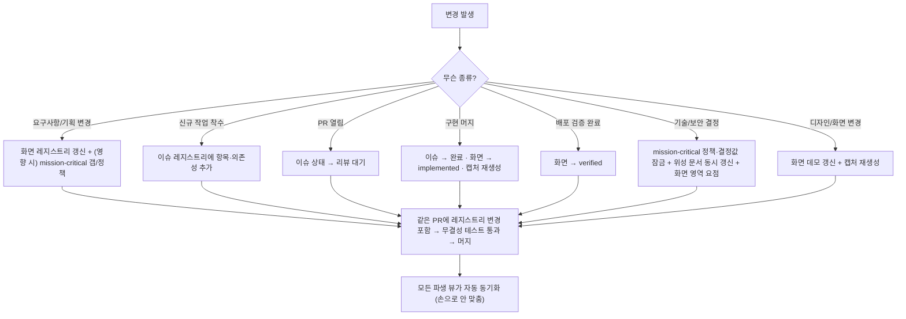

# PlayBoard — 핵심 효용과 운영 규칙 (Benefits & Operation Rules)

> 이 문서는 PlayBoard를 **"만드는 법"이 아니라 "실제로 효용을 누리는 운영법"**을 집대성한다. PlayBoard가 동시에 수행하는 역할 — 통합형 단일 명세서, 살아있는 상황판, mission-critical 기술 스펙 허브, PM·회의 도구, 실체적 코드 기반 사이트 아이덴티티 샘플 — 각각의 효용을 **무엇을 하면 살고 무엇을 하면 죽는지**까지 규칙으로 못 박는다.
>
> **이 문서의 자리:**
> - **본 문서(BENEFIT_N_OPERATION_RULE)** = 효용 + 운영 규칙 (왜 쓰고, 어떻게 운영해 효용을 유지하는가)
> - `PLAYBOARD_FINAL_SPEC_DEFINITION.md` = 프레임워크·테마 무관 재현 스펙 (구조를 어떻게 만드는가)
> - `PLAYBOARD_REPRODUCIBLE_SPEC.md` = 호스트 repo의 구체 구현 스펙 (실제 파일·레지스트리·테스트) — *호스트 프로젝트가 재현하며 직접 생성하는 문서로, 이 스킬 패키지에는 동봉되지 않는다.*
>
> 운영 규칙의 강제 메커니즘(동시 갱신·양방향 싱크)은 `CLAUDE.md`/`AGENTS.md`의 "PlayBoard — 기획·구현·운영 통합 SoT" 절과 이중 명시된다.

---

## 0. 한 줄 정의와 운영 제1원칙

**PlayBoard = 기획·이슈·구현·일정·기술정책·디자인 실체가 하나의 살아있는 표면으로 수렴하는, 코드에서 파생되는 단일 진실 공급원(SoT).**

운영 제1원칙(이것 하나가 모든 효용의 전제):

> **표시되는 모든 것은 레지스트리에서 파생한다. 두 곳을 손으로 맞추지 않는다.**
> 사실(fact)은 레지스트리 한 곳에만 적고, 보드의 모든 뷰는 그것을 계산해 보여준다. 이 원칙이 깨지는 순간(= 보드와 실제가 따로 노는 순간) 아래 5대 효용은 동시에 무너진다.

---

## 1. 한 보드가 대체하는 것 (통합의 실체)

PlayBoard 1개가 흩어진 산출물 N개를 대체한다. 이 매핑이 "통합형 명세서" 효용의 구체다.

| 전통적 산출물 | PlayBoard 표면 | 대체로 얻는 것 |
|---|---|---|
| 기획서 / 화면정의서 (PRD·와이어) | 화면 레지스트리 + `spec/:plane/:slug` + 화면 데모 | 기획이 구현·상태와 한 곳에서 묶임 |
| 이슈 트래커 칸반 | 인덱스 상황판 + `plan`(DAG) + 구현 통계 | 진척이 의존성·산출물과 연결됨 |
| 로드맵 / 간트 | `schedule`(wave + Gantt) | 의존성에서 **자동 파생**된 병렬 일정 |
| 기술 설계서 / 보안 정책 문서 | `mission-critical/:area` | 정책이 대응 화면·이슈와 추적 가능 |
| 디자인 시스템 / 프로토타입(Figma) | 화면 데모 `screens/:plane/:slug` + 캡처 | **실 코드 기반** 살아있는 아이덴티티 샘플 |
| 진척 보고서 / 회의자료 | 인덱스 상황판 + 시나리오 walkthrough | 별도 제작 없이 화면이 곧 회의자료 |
| 추적성/커버리지 매트릭스 | 구현 통계(화면 × 제어영역) | 기획-구현-정책 커버리지를 한 표로 |

> **운영 함의:** 새 도구·문서를 추가하기 전에 "이건 PlayBoard 어느 표면이 이미 담는가?"를 먼저 묻는다. 중복 산출물을 만들면 통합 효용이 그만큼 샌다.

---

## 2. 5대 핵심 효용 — 효용 · 표면 · 운영 규칙 · 안티패턴

각 효용은 **(가) 무엇을 주는가 → (나) 어느 표면이 실현하는가 → (다) 효용을 살리는 운영 규칙 → (라) 효용을 죽이는 안티패턴**으로 규정한다.

### 2.1 통합형 단일 명세서 (기획 + 구현 + 기술 스펙이 한 곳)

- **(가) 효용:** 기획 의도·구현 현황·기술 계약·근거가 화면 단위로 한 데 묶여, "기획서 따로, 코드 따로, 정책 따로"의 표류(drift)가 사라진다.
- **(나) 표면:** 화면 레지스트리 → `spec/:plane/:slug`(화면 계약 + 엔지니어링 제어 + 연결 이슈 + 캡처).
- **(다) 운영 규칙:**
  - R1. **요구사항 변경은 원천 문서가 아니라 레지스트리에 반영**한다. 원천 기획서(PRD 등)는 *근거 문서로 동결*하고, 충돌 시 PlayBoard가 우선임을 그 문서 상단에 고지한다.
  - R2. 화면 신설·계약 변경은 **같은 PR에서 레지스트리(화면·이슈)와 함께** 반영한다.
  - R3. 각 화면의 엔지니어링 계약(인가 게이트·데이터 읽기/쓰기·계측 이벤트·예외 상태)은 **빈칸 없이** 채운다 — 빈 계약은 "미정"이 아니라 "기재 누락"으로 간주한다.
- **(라) 안티패턴:** 기획서에는 바뀐 요구사항이, 코드에는 다른 구현이, 레지스트리에는 옛 상태가 — 세 곳이 다르면 "통합 명세서"는 거짓 명세서가 된다.

### 2.2 살아있는 상황판 (이슈·구현 결과물 현황)

- **(가) 효용:** "지금 무엇이 어디까지 됐는지"를 누구나 즉시 안다. 상태를 묻는 회의·핑이 사라진다.
- **(나) 표면:** 인덱스 상황판(상태별 카운트), `implement-summary`(화면×제어영역 매트릭스), `plan`(이슈 DAG), 화면 보드(타일/칸반).
- **(다) 운영 규칙:**
  - R4. **상태는 코드 변경과 같은 시점에 전이**시킨다. 지연된 상태 갱신은 보드를 거짓말쟁이로 만든다.
  - R5. 상태 전이 규약을 고정한다:
    - 이슈: `미착수 → 리뷰 대기(PR 열림) → 완료(머지)`.
    - 화면: `기획확정 → 부분구현 → 구현·머지완료 → 배포검증완료`. **구현 머지 시 implemented, 배포 검증 후에만 verified**로 올린다.
  - R6. 구현 결과물이 바뀌면 **캡처를 재생성**한다(상황판 썸네일 = 실제 화면이라는 약속 유지).
- **(라) 안티패턴:** "나중에 한꺼번에 갱신" → 보드가 코드보다 며칠 뒤처짐 → 아무도 안 믿음 → 다시 슬랙/구두로 상태 확인(효용 0).

### 2.3 mission-critical 고수준 기술 스펙 허브

- **(가) 효용:** 보안·접근제어·데이터 무결성·장애복구·관측성·성능 등 **횡단 관심사의 결정이 한 곳에 잠기고**, 어느 화면이 그 정책을 지는지 추적된다.
- **(나) 표면:** `mission-critical/:area`(목표·확정 정책·운영 결정값·기준 문서·대응 화면·관련 이슈·미해소 갭) + 구현 통계 매트릭스의 영역 커버리지(●).
- **(다) 운영 규칙:**
  - R7. **결정은 명시적으로 잠근 뒤 진행**한다. 잠긴 결정은 `확정 정책/운영 결정값`, 아직 못 정한 것은 `미해소 갭`에 **정직하게** 남긴다(빈 갭 ≠ 갭 없음).
  - R8. **갭 승격 규칙:** 갭이 해소되면 확정 정책·결정값으로 올리고 `gaps`에서 제거한다(갭 목록은 줄어드는 방향이 정상).
  - R9. **양방향 싱크:** 상세 기준 문서(보안·런북 등)는 레지스트리의 *위성 문서*다. 어느 쪽이 바뀌든 **같은 PR에서 양쪽을 갱신**하고, 각 기준 문서 상단에도 동일 싱크 고지를 둔다.
  - R10. 화면이 그 관심사를 다루면 화면 레지스트리에 **영역 요점**을 적는다 — 이게 매트릭스 ●와 영역 상세의 "대응 화면"을 동시에 채운다(이중 정의 금지).
- **(라) 안티패턴:** 보안 결정을 기준 문서에만 쓰고 레지스트리에 미반영 → 매트릭스에 커버리지가 안 잡힘 → "정책은 있는데 어느 화면이 지는지 모름".

### 2.4 PM 도구 · 회의자료

- **(가) 효용:** **별도 회의자료 제작이 사라진다.** 보드 표면이 곧 회의 화면이다(§4 루틴).
- **(나) 표면:** 인덱스 상황판(현황 공유), `plan`+`schedule`(착수 계획), 구현 통계(커버리지 리뷰), mission-critical(기술/보안 리뷰), 시나리오 walkthrough·UX flow(데모).
- **(다) 운영 규칙:**
  - R11. **회의 직전이 아니라 평소에 보드를 최신으로** 유지한다(R4). 회의자료를 따로 안 만드는 효용은 "보드가 항상 진실"일 때만 성립한다.
  - R12. 회의 유형마다 **여는 표면을 고정**한다(§4 표). 매번 어떤 화면을 띄울지 고민하지 않는다.
  - R13. 회의 중 결정은 그 자리에서 **레지스트리에 반영**한다(상태 전이·갭 승격·신규 이슈) — 회의록을 따로 남기지 않고 보드가 회의록이 된다.
- **(라) 안티패턴:** 회의용 슬라이드를 따로 만든다 → 보드와 슬라이드가 또 갈라짐 → 통합·신선도 효용 동시 붕괴.

### 2.5 실체적 코드 = 사이트 아이덴티티 샘플 (프로토타입/디자인시스템 불요)

- **(가) 효용:** 별도 Figma·디자인시스템·프로토타입 없이도, **실 코드로 동작하는 화면 데모**가 사이트의 아이덴티티·디자인 언어를 명확히 보여주는 살아있는 샘플이 된다.
- **(나) 표면:** 화면 데모 `screens/:plane/:slug`(실 코드·반응형) + 캡처 파이프라인 + 데스크톱/모바일 흐름 오버뷰.
- **(다) 운영 규칙:**
  - R14. 새 화면은 **데모를 함께** 만들고 캡처 파이프라인에 편입한다(구현됨=실 라우트 캡처, 기획 단계=데모 mock 캡처).
  - R15. 데모는 **반응형**을 유지한다 — 모바일 흐름이 같은 데모 라우트를 모바일 폭으로 로드하므로, 데모가 곧 모바일 검증 수단이다.
  - R16. 디자인 토큰·컴포넌트는 **데모가 실증**한다. 디자인 변경은 데모에 먼저 반영되어 캡처로 드러난다(별도 디자인 산출물을 두지 않는다).
- **(라) 안티패턴:** 데모를 방치해 실제 화면과 달라짐 → 아이덴티티 샘플이 거짓 → 결국 외부 디자인 도구를 다시 도입(효용 상실).

---

## 3. 운영 규칙 집대성 (Rulebook)

§2의 규칙을 운영 영역별로 다시 모은 단일 규칙집. **명령형으로 단정**한다.

### 3.1 SoT 무결성
- 파생 only — 사실은 레지스트리 한 곳, 표시는 모두 파생(제1원칙).
- 동시 갱신 — 요구사항 변경·신규 이슈·상태 변화·화면 신설/계약 변경은 **같은 변경 단위(PR/커밋)**에서 레지스트리를 함께 갱신.
- 양방향 싱크 — 위성 기준 문서 ↔ 레지스트리는 같은 PR, 문서 상단 이중 고지.
- 원천 동결 — 원천 기획서는 근거로 동결, 충돌 시 PlayBoard 우선.
- 무결성 잠금 — 레지스트리 참조·DAG 비순환·커버리지·문서 경로를 **자동 검사(테스트)로 강제**.

### 3.2 상태·신선도
- 상태는 코드와 동시 전이(지연 금지).
- 상태 전이 규약 고정(R5).
- 구현 변경 시 캡처 재생성(R6).
- 보드가 코드보다 뒤처진 채로 회의·공유에 쓰지 않는다.

### 3.3 mission-critical
- 결정은 잠근 뒤 진행, 미정은 갭에 정직하게(R7).
- 갭은 승격하며 줄인다(R8).
- 화면 영역 요점은 레지스트리에 단일 기재(R10).

### 3.4 아이덴티티 샘플
- 새 화면 = 데모 + 캡처 동반(R14).
- 데모 반응형 유지(R15), 디자인은 데모가 실증(R16).

### 3.5 노출·공유
- 노출 게이트: **로컬 개발은 자동 노출**, 그 외(preview·production)는 `PROTOTYPE_ENABLED=true`일 때만 노출된다 — 프리뷰 스코프에만 플래그를 켜 이해관계자에게 열고, **production은 기본 비공개**로 둔다.
- 외부 이해관계자 공유는 프리뷰 배포 URL로(별도 문서 export 금지 — 항상 살아있는 보드를 본다).

### 3.6 변경 1건의 표준 처리 흐름

어떤 변경이 들어오든 "같은 PR에서 무엇을 갱신하는가"를 고정한다.

---

## 4. 회의 · PM 운영 루틴

별도 회의자료를 만들지 않는다. **회의 유형마다 여는 표면을 고정**한다.

| 회의/리듬 | 여는 표면 | 보는 것 | 그 자리에서 하는 갱신 |
|---|---|---|---|
| 일일/수시 현황 | 인덱스 상황판 + 화면 보드(칸반) | 상태별 카운트, 컬럼별 진척 | 상태 전이 |
| 착수 계획 | `plan`(DAG) + `schedule`(wave) | 다음 wave 병렬 착수 후보·차단 선행 | 신규 이슈·의존성 |
| 커버리지/품질 리뷰 | 구현 통계 매트릭스 | 화면×제어영역 ● 갭, 상태 분포 | 누락 영역 요점 보강 |
| 기술/보안 리뷰 | `mission-critical/:area` | 확정 정책·결정값·미해소 갭 | 결정 잠금·갭 승격 |
| 데모/이해관계자 공유 | 시나리오 walkthrough + UX/모바일 흐름 | 흐름 순서대로 실 화면 | (피드백을 이슈로) |
| 회고 | mission-critical 갭 추세 + 상태 진척 | 해소된 갭, 완료율 | 다음 사이클 갭 정리 |

루틴 진행법(공통): ① 표면을 연다 → ② 보드가 곧 안건 → ③ 결정을 **그 자리에서 레지스트리에 반영**(R13) → ④ 보드가 회의록을 대신한다.

---

## 5. 효용 건강도 점검 (Board Health)

효용은 운영을 멈추면 샌다. 아래가 무너지면 어떤 효용이 죽는지 함께 본다.

| 점검 항목 | 건강 기준 | 무너지면 죽는 효용 |
|---|---|---|
| **신선도** | 보드 상태가 실제 코드/배포와 일치(지연 0) | 2.2 상황판, 2.4 회의도구 |
| **파생 일관성** | 같은 사실이 두 곳에 중복 기재되지 않음 | 2.1 통합 명세서 |
| **커버리지** | 모든 제어 영역 ≥1 화면, 모든 implemented/verified 화면이 구현 위치 보유 | 2.3 기술 허브 |
| **갭 위생** | 갭 개수가 추세적으로 감소, 오래 방치된 갭 없음 | 2.3 기술 허브 |
| **DAG 건강** | 비순환 + 완료 이슈의 선행도 모두 완료 | 2.2 상황판(일정 신뢰) |
| **캡처 최신성** | 캡처 = 현재 화면 | 2.5 아이덴티티 샘플 |
| **무결성 테스트** | green(참조·DAG·커버리지·문서경로) | 전부 |

> **운영 신호:** 무결성 테스트가 자동으로 위 대부분을 잡는다. 테스트가 빨간데 머지하면 효용이 새고 있다는 직접 신호다.

---

## 6. 안티패턴 ↔ 교정 (모아보기)

| 안티패턴 | 결과 | 교정 |
|---|---|---|
| 레지스트리를 코드와 따로 갱신 | stale board → 불신 | 같은 PR 동시 갱신(R2/R4) |
| 같은 사실을 두 곳에 중복 기재 | drift | 파생 only(제1원칙) |
| 회의용 슬라이드 별도 제작 | 또 하나의 진실원 분열 | 보드 표면을 회의자료로(R11/R12) |
| 캡처 방치 | 거짓 아이덴티티 샘플 | 구현 변경 시 캡처 재생성(R6/R14) |
| 갭을 비워두고 "완료" 선언 | 숨은 미해소 | 갭에 정직하게, 승격으로 비움(R7/R8) |
| 보안 결정을 문서에만 기재 | 커버리지 미반영 | 레지스트리에 영역 요점 + 양방향 싱크(R9/R10) |
| 상태 인코딩/규약 임의 변경 | 표면 간 일관성 붕괴 | 상태 전이 규약 고정(R5) |
| 외부에 문서로 export해 공유 | 시점이 박제된 옛 정보 | 프리뷰 URL로 살아있는 보드 공유(§3.5) |

---

## 7. 정착 점검 — "효용을 실제로 누리고 있는가"

도입 여부가 아니라 **효용을 실제로 거두고 있는지**를 점검한다.

- [ ] 상태를 묻는 핑/회의가 줄었다(→ 2.2 신선도 성립).
- [ ] 기획·구현·정책을 확인할 때 PlayBoard 한 곳만 연다(→ 2.1 통합 성립).
- [ ] 회의에 별도 자료를 만들지 않는다(→ 2.4 성립).
- [ ] 보안/기술 결정을 물으면 `mission-critical`을 가리킨다(→ 2.3 성립).
- [ ] 디자인/화면 모습을 보여줄 때 화면 데모/캡처를 연다(→ 2.5 성립, 외부 프로토타입 미사용).
- [ ] 무결성 테스트가 green이고, 머지마다 레지스트리가 함께 바뀐다(→ 전 효용 유지 메커니즘 작동).

위 중 하나라도 "아니오"면, 해당 효용을 살리는 §2 운영 규칙으로 돌아간다.

---

## 부록. 효용 → 표면 → 핵심 규칙 → 실패모드 (한 장 요약)

| 효용 | 실현 표면 | 핵심 운영 규칙 | 효용을 죽이는 실패모드 |
|---|---|---|---|
| 통합 명세서 | 화면 레지스트리·spec | 파생 only · 동시 갱신 · 계약 빈칸 금지 | 기획/코드/레지스트리 3중 표류 |
| 살아있는 상황판 | 인덱스·매트릭스·DAG·칸반 | 코드와 동시 상태 전이 · 전이 규약 고정 | 지연 갱신으로 보드 뒤처짐 |
| 기술 스펙 허브 | mission-critical·매트릭스 | 결정 잠금 · 갭 승격 · 양방향 싱크 | 결정이 문서에만, 커버리지 미반영 |
| PM·회의 도구 | 모든 보드 표면 | 회의별 표면 고정 · 그 자리 반영 | 별도 슬라이드 제작 |
| 아이덴티티 샘플 | 화면 데모·캡처 | 데모+캡처 동반 · 반응형 유지 | 데모 방치로 실제와 괴리 |
