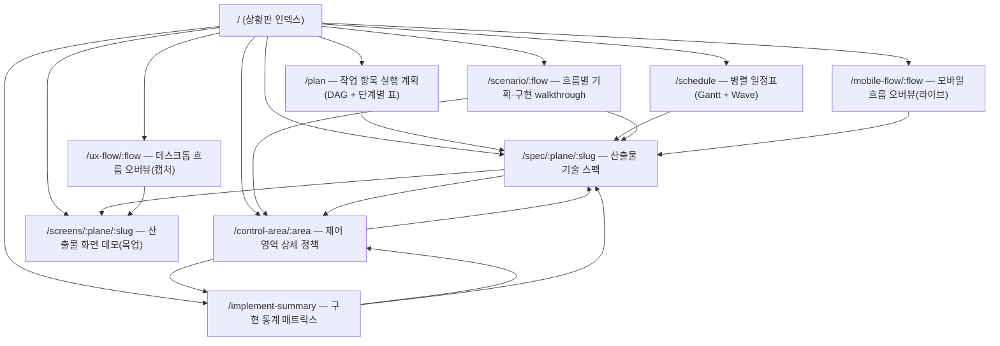
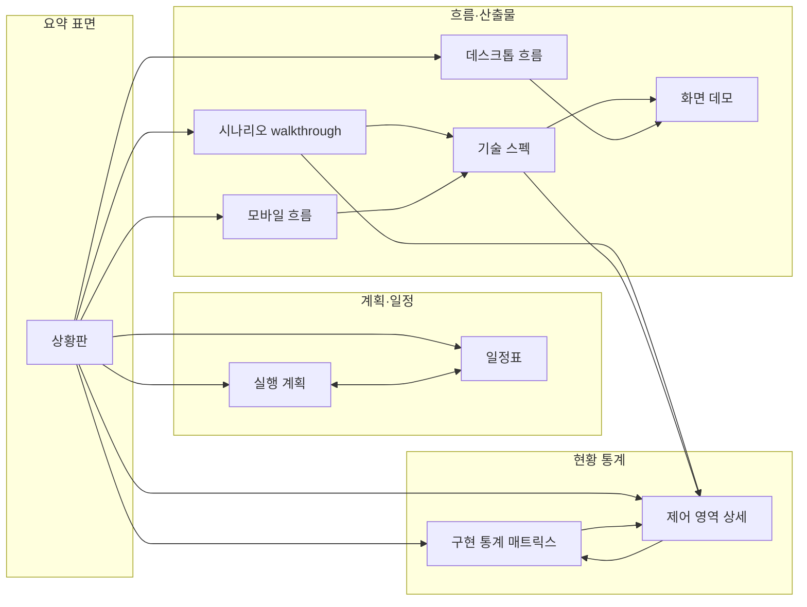
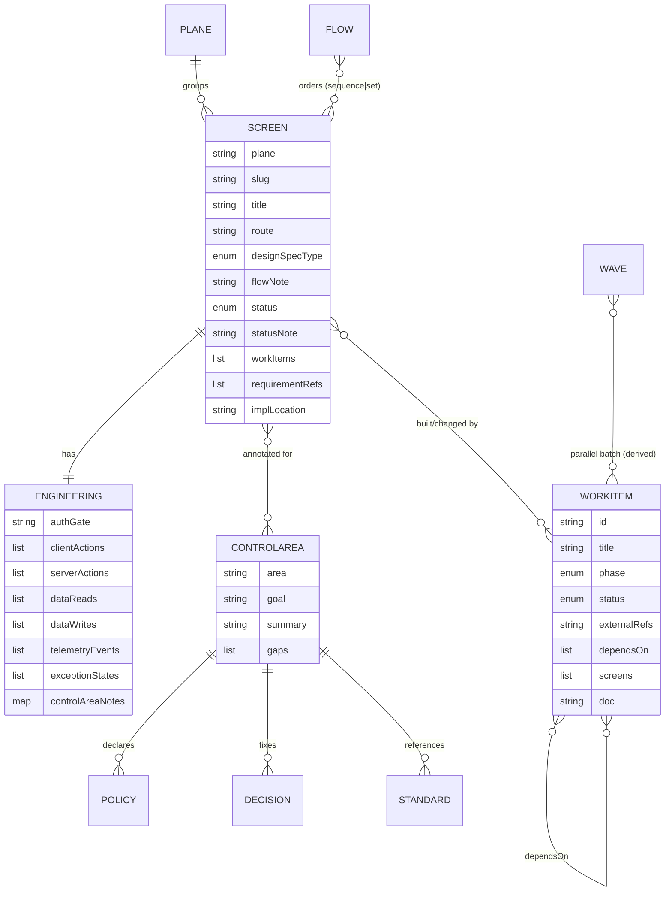
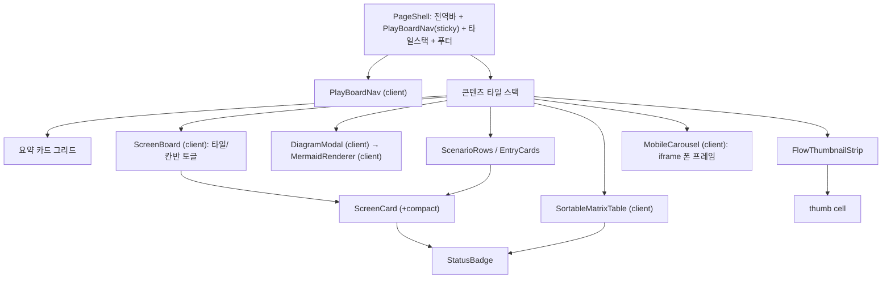
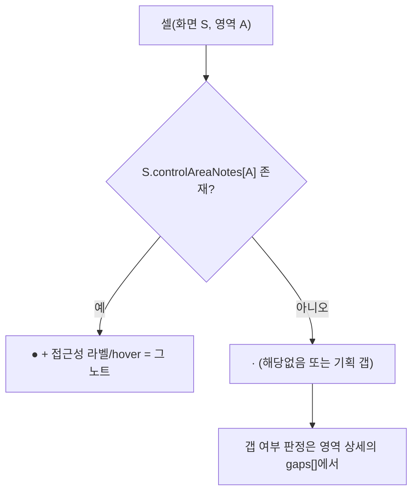
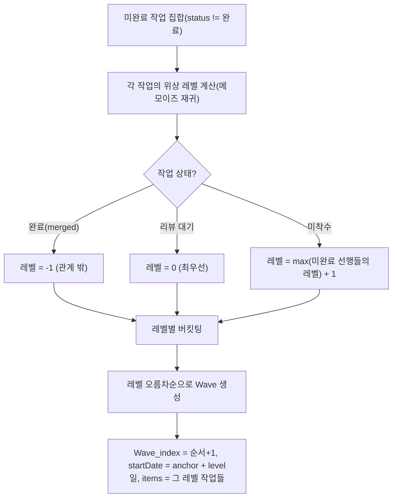
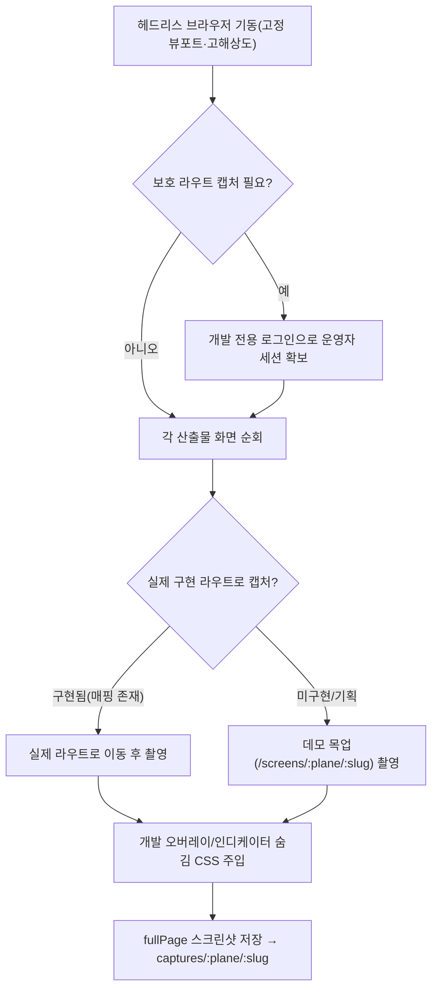

# PlayBoard — 범용 스펙 정의서 (도메인·프레임워크·테마 비종속)

> 이 문서는 **동작하는 “기획·구현 상황판(PlayBoard)” 페이지의 최종 UX 결과물**을, 도메인·기술스택·디자인 테마가 모두 다른 임의의 프로젝트에서도 **그대로 재현**할 수 있도록 정의한 구조 스펙이다.
>
> **범위 포함:** 정보 구조, 라우트/내비게이션, 데이터 모델, 페이지별 구성과 레이아웃, 각 요소의 표현 방법(무엇을 어떻게 보여주는가), 상호작용 계약, 파생 알고리즘, 재현 체크리스트.
> **범위 제외(의도적):** 색상·폰트·간격·그림자·테마 등 **심미적 요소**. 본 문서는 “무슨 요소가 어디에 어떤 형태로 놓이고 무엇을 표현하는가”만 규정하며, 그 시각적 마감은 호스트 프로젝트의 디자인 시스템에 위임한다.
>
> 표기 규약: 레이아웃은 ASCII 와이어프레임으로, 구조·관계·알고리즘은 Mermaid로 표현한다. 치수는 “심미 값”이 아닌 **기능적 분기점**(예: 모바일 뷰포트 폭)만 명시한다.

---

## 0. 용어 (일반화 사전)

이 패턴은 6개의 1급 개념으로 구성된다. 프로젝트 고유 명칭은 모두 아래 일반 용어로 치환해 읽는다.

| 일반 용어 | 정의 | 참조 구현의 예시 명칭(치환 대상) |
|---|---|---|
| **산출물 화면(Screen)** | 상황판이 추적하는 단위 결과물. 보통 “앱의 한 페이지”. | lesson/cohort/admin 화면 |
| **평면(Plane)** | 산출물 화면을 묶는 최상위 분류 축(주체·성격 기준). 소수(2~4개) 권장. | end-user / operator / system-state |
| **구현 상태(Status)** | 산출물의 진척을 나타내는 **순서 있는 1차원 단계**. 4단계 권장. | planned / in-progress / implemented / verified |
| **작업 항목(Work Item)** | 산출물을 만들거나 바꾸는 작업 단위. 서로 **의존(DAG)** 한다. | issue/PR |
| **횡단 제어 영역(Control Area)** | 여러 화면을 가로지르는 비기능 정책 축(보안·성능·장애복구 등). | mission-critical 7영역 |
| **사용자 흐름(Flow)** | 한 평면의 산출물 화면들을 **순차 시나리오** 또는 **독립 케이스 집합**으로 묶은 것. | 학생 흐름 / 강사 흐름 / 예외 처리 |

파생 개념: **병렬 착수 묶음(Wave)** = 작업 항목 DAG에서 동시 착수 가능한 그룹(§7.2 알고리즘).

---

## 1. 개념 정의 — PlayBoard란 무엇인가

PlayBoard는 **기획·기술요구사항·구현현황·일정·정책이 한 곳으로 수렴하는 프로젝트 단일 진실 공급원(SoT) 표면**이다. 정적 문서(README·기획서)와 달리, **레지스트리(구조화된 데이터)에서 모든 화면을 파생 렌더**하므로 데이터 한 줄을 바꾸면 모든 뷰가 동시에 갱신된다.

핵심 성질 4가지(재현 시 반드시 유지):

1. **레지스트리 → 파생 뷰 단방향.** 모든 표면은 6개 레지스트리(§3)에서 계산된다. 화면에 하드코딩된 목록이 없다.
2. **하나의 산출물 = 다관점 동시 표현.** 같은 산출물 화면이 (a)썸네일 카드, (b)상태 칸반, (c)커버리지 매트릭스 행, (d)시나리오 walkthrough, (e)기술 스펙 페이지, (f)데스크톱/모바일 흐름에서 **동일 식별자**로 반복 등장한다.
3. **상태 인코딩의 전면 일관성.** 같은 상태는 모든 표면(카드/표/그래프 노드/간트 막대)에서 **동일한 시각 배지**로 표현된다(배지의 *형태가 일관*하다는 것이 스펙이며, 그 *색*은 테마 위임).
4. **노출 게이트.** 운영(production) 사용자에게는 기본 비공개(404), 개발/프리뷰에서만 노출(§9).

---

## 2. 정보 구조 — 라우트 맵

PlayBoard는 1개의 인덱스(상황판)와 그 아래 9종의 표면, 합쳐 **10개 라우트**로 구성된다. 라우트 식별자는 일반화 명칭이다(호스트 라우팅 규약에 매핑).



라우트 파라미터:
- `:plane` — 평면 식별자. `:slug` — 평면 내 산출물 화면 식별자.
- `:flow` — 흐름 식별자(보통 평면과 1:1). `:area` — 제어 영역 식별자.
- 존재하지 않는 파라미터는 **404**로 처리한다(파라미터 검증 = 레지스트리 조회 실패).

### 2.1 표면 간 교차 링크(내비게이션 그래프)

각 표면이 어디로 “파고드는지(drill-in)”의 계약. 화살표 = 클릭 가능한 내부 이동.



---

## 3. 데이터 모델 (일반화 레지스트리)

6개 레지스트리가 SoT다. 아래는 도메인 무관 필드 계약이다(타입은 개념적 표기).



### 3.1 산출물 화면 레지스트리 (Screen)

| 필드 | 의미 | 표현에 쓰이는 곳 |
|---|---|---|
| `plane` | 평면 식별자 | 매트릭스 평면 라벨, 라우트 |
| `slug` | 평면 내 고유 키 | URL, 캡처 파일명, React key |
| `title` | 사람이 읽는 제목 | 모든 카드/행/헤더 |
| `route` | 이 화면이 표현하는 **실제 앱 경로**(목적지가 아니라 “설명 대상”) | 카드 부제, 스펙 “앱 라우트” |
| `designSpecType` | 디자인 분류(예: 서비스형/콘텐츠형) — **분류 라벨만**, 색·테마 아님 | 카드 메타, 스펙 |
| `flowNote` | 흐름상 한 줄 설명 | walkthrough, 스펙 |
| `status` | 구현 상태(§3.5) | 배지(전 표면) |
| `statusNote?` | 부분구현 등 보충 | walkthrough, 스펙 |
| `workItems[]` | 이 화면을 만든/바꾼 작업 항목 id | 스펙 “연결된 작업” |
| `requirementRefs[]` | 동결 기획서 근거 참조 | 스펙 “요구사항 근거” |
| `implLocation?` | 구현 위치(파일/모듈). 없으면 “미구현” | 스펙, walkthrough |
| `engineering` | 엔지니어링 제어 스펙(§3.2) | 스펙, walkthrough |

### 3.2 엔지니어링 제어 스펙 (Screen.engineering)

| 필드 | 의미 |
|---|---|
| `authGate` | 인가 게이트 한 줄(어떤 가드, 미인가 시 동작=거부/은닉/복귀) |
| `clientActions[]` | 주요 클라이언트 동작(상호작용·폼·내비·계측 전송) |
| `serverActions[]` | 주요 서버 동작(인가·DB·외부연동) |
| `dataContract.reads[]` / `.writes[]` | 운영 데이터 읽기/쓰기 계약 |
| `telemetryEvents[]` | 이 화면이 수집하는 계측 이벤트 |
| `exceptionStates[]` | 연결된 예외 상태 화면 slug(시스템 상태 평면) |
| `controlAreaNotes` | `{제어영역 → 이 화면에서의 요점}` 맵. **이 맵의 키 존재 여부**가 §6 매트릭스의 “●” 채움을 결정한다. |

### 3.3 평면 분류 (Plane)

- 소수의 최상위 그룹. 권장 3종: **(A) 주 사용자 도메인**, **(B) 운영자 도메인**, **(C) 시스템 상태**(에러/만료 등 “화면이라기보다 상태”).
- 평면은 흐름(§3.6)과 보통 1:1. 시스템 상태 평면은 비순차(독립 케이스)다.

### 3.4 구현 상태 분류 (Status) — 순서 있는 단계

권장 4단계(칸반 진행 순서, 좌→우):


- 이 순서는 칸반 컬럼 순서·매트릭스 정렬·요약 카운트의 **단일 정렬 기준**이다.
- 각 단계는 **고정 라벨 + 고정 배지 형태**를 갖는다(색은 테마 위임, 형태·라벨은 스펙).
- 작업 항목(Work Item)은 별도의 3단계 상태를 갖는다: **미착수 / 리뷰 대기 / 완료**.

### 3.5 작업 항목 레지스트리 (Work Item) — DAG

| 필드 | 의미 |
|---|---|
| `id` | 항목 식별자(정렬·노드 id) |
| `title` | 제목 |
| `phase` | 단계/마일스톤(그룹핑·정렬용, §3.6) |
| `status` | 미착수/리뷰대기/완료 |
| `externalRefs?` | 외부 트래커/PR 번호(선택) |
| `dependsOn[]` | 선행 항목 id(DAG 간선) — **비순환 보장** |
| `screens[]` | 이 항목이 건드리는 산출물 화면 키(`plane/slug`) |
| `doc` | 상세 문서 경로 |

### 3.6 단계 분류 (Phase)

- 작업 항목을 마일스톤 단위로 묶는 **명시적 순서 배열**(예: 0,1,2,…,후속). 언어 기본 `Object.keys` 정렬에 의존하지 말고 **명시 순서 배열**을 둔다(혼합 키 정렬 버그 방지).

### 3.7 제어 영역 레지스트리 (Control Area)

| 필드 | 의미 |
|---|---|
| `area` | 영역 식별자 |
| `goal` | 한 줄 목표 |
| `summary` | 자기완결 개요(영역 SoT 진입점) |
| `policies[]` | `{statement, detail}` — 확정 정책(결정 잠김) |
| `decisions[]` | `{name, value}` — 운영 결정값(임계값·환경값) |
| `standards[]` | `{title, path}` — 위성 기준 문서 |
| `workItems[]` | 이 영역을 구현하는 작업 항목 id |
| `gaps[]` | 미해소 항목(해소되면 정책/결정값으로 승격하고 제거) |

> 화면별 요점(`Screen.engineering.controlAreaNotes`)과 영역 SoT(이 레지스트리)는 **양방향 싱크**다: 한쪽이 바뀌면 같은 변경 단위(커밋/PR)에서 다른 쪽과 위성 기준 문서를 함께 갱신한다.

---

## 4. 공통 레이아웃 규약 & 재사용 프리미티브

모든 페이지가 공유하는 골격과 부품. **형태·배치 계약만 규정**(색/폰트/간격 제외).

### 4.1 페이지 골격 (Page Shell)

```
┌───────────────────────────────────────────────────────────┐
│ [전역 상단 바]  (호스트 앱의 글로벌 내비 — 좌: 제품명, 우: 섹션)  │
├───────────────────────────────────────────────────────────┤
│ [PlayBoard 내비 바]  ← sticky(상단 고정)                      │
│   좌: PlayBoard / breadcrumb(상위 → 현재)                     │
│   우: 섹션 탭 [상황판][실행 계획][일정표][구현 통계] (현재 강조)  │
├───────────────────────────────────────────────────────────┤
│ [콘텐츠 타일 1]  (중앙 정렬, 최대폭 제한, 배경 교차)            │
│ [콘텐츠 타일 2]                                              │
│ …                                                          │
├───────────────────────────────────────────────────────────┤
│ [푸터]  (선택적 note 문구)                                    │
└───────────────────────────────────────────────────────────┘
```

규약:
- **콘텐츠는 “타일(섹션 블록)”의 세로 스택**으로 구성. 인접 타일은 배경을 **교차**시켜 시각적으로 구획한다(교차의 *유무*가 스펙, 두 배경의 *색*은 테마).
- 콘텐츠 폭: 보드형 페이지는 **넓은 최대폭**, 읽기형(흐름 오버뷰 등)은 **좁은 가독 폭**. 두 등급의 폭 토큰만 두고 페이지가 선택한다.
- 모든 타일은 중앙 정렬 + 좌우 여백(반응형).

### 4.2 PlayBoard 내비 바 (client)

- **상단 sticky.** 스크롤해도 고정.
- **좌측 breadcrumb:** 항상 “PlayBoard”(인덱스 링크)로 시작, 이후 `/` 구분자로 현재 위치까지. 마지막 항목은 비링크(현재). 깊은 페이지(스펙·정책·시나리오·흐름)는 상위 경로를 노출.
- **우측 섹션 탭:** 4개 1급 섹션(상황판/실행 계획/일정표/구현 통계). 현재 경로와 매칭되는 탭을 **강조 상태**로 표시(`aria-current`). 매칭 규칙은 경로 prefix(예: 제어영역 상세는 “구현 통계” 탭이 활성).
- 좁은 폭에서 탭은 가로 스크롤.

### 4.3 상태 배지 (Status Badge) — 전 표면 공용

- 산출물 상태(4단계)·작업 상태(3단계) 각각에 **1:1 대응하는 작은 캡슐형 배지**. 라벨 텍스트 고정.
- **동일 상태 = 동일 형태**가 모든 표면(카드·매트릭스 셀·DAG 노드·Gantt 막대)에서 반복. 색 토큰은 호스트가 채우되, **하나의 상태 팔레트를 비-마크업 표면(다이어그램)에도 동일하게 주입**할 수 있게 토큰을 한 곳에서 관리한다.

### 4.4 키-값 스펙 행 (Spec Row / Spec List)

- `라벨(고정폭, 좌) · 값(가변, 우)` 의 정의형 행. 좁은 폭에서는 라벨이 위, 값이 아래로 쌓임.
- 값이 목록이면 불릿 리스트, 비면 “없음/수집 없음” 등 **빈 상태 문구**를 명시 표기.

### 4.5 산출물 썸네일 카드 (Screen Card)

```
┌──────────────────────────┐
│  [화면 캡처 썸네일]         │ ← 클릭 → 기술 스펙 페이지
│  (16:10, 상단 정렬 crop)   │   (compact 모드: 우상단 상태 배지 오버레이)
├──────────────────────────┤
│ PLANE · 디자인분류    [배지]│
│ 제목                      │
│ /실제-라우트               │
│ [기술 스펙]  [화면 데모]    │ ← 두 텍스트 링크
└──────────────────────────┘
```

- 썸네일·“기술 스펙” 링크 → `/spec/:plane/:slug`(동일 목적지). “화면 데모” → `/screens/:plane/:slug`.
- **compact 변형**(칸반용): 메타 영역의 상태 배지를 제거하고 썸네일 우상단에 오버레이.
- 썸네일이 없을 산출물(미구현)도 깨진 이미지가 아니라 자리표시가 보이게 한다(캡처 파이프라인 §8).

### 4.6 다이어그램 모달 (Diagram Modal, client)

- 큰 다이어그램(DAG·Gantt)을 **인라인에선 축소 미리보기**(최대 높이 제한 + 하단 페이드 + “클릭하여 크게 보기” 오버레이 버튼)로 두고, 클릭하면 **뷰포트를 거의 채우는 모달**에서 자연 크기로 본다.
- 모달은 **포털로 최상위에 렌더**(쌓임 맥락 탈출). 배경 클릭·ESC로 닫힘, 열린 동안 배경 스크롤 잠금. 모달 헤더에 제목 + 범례 + 닫기.
- 미리보기/모달은 **서로 다른 렌더 설정**(미리보기=컨테이너 맞춤 축소, 모달=자연 크기·큰 폰트·스크롤)을 받는다.
- 구현 주의: 클릭 오버레이를 다이어그램 내부 버튼과 **중첩(버튼 안 버튼)시키지 말 것**(중첩 시 hydration 오류 → 트리 재생성 → 렌더 누락). 형제 오버레이로 둔다.

### 4.7 컴포넌트 조합 트리



상호작용 “섬(island)”은 5개뿐이다: **PlayBoardNav, ScreenBoard(토글), SortableMatrixTable, DiagramModal, MobileCarousel.** 나머지는 모두 정적 렌더 가능. → 어떤 프레임워크든 “대부분 정적 + 5개 클라이언트 위젯”으로 이식 가능.

---

## 5. 페이지별 상세 스펙

각 페이지는 **목적 / 진입 / 레이아웃(와이어프레임) / 구성 요소(요소별 표현) / 상호작용 / 데이터·파생 / 교차 링크** 순으로 규정한다.

### 5.1 상황판 인덱스 (`/`)

**목적.** 프로젝트 전모를 한 화면에서 조망하는 진입점. 6개 레지스트리의 요약과 모든 표면으로의 분기.

**레이아웃 (타일 6단 세로 스택):**

```
[타일1: 히어로]   2단 그리드(좌 넓음 / 우 좁음)
  좌: 제품 정체성(제목, 부제, 목적 불릿 5개)
  우: "UX Flow" aside
       · 사용자 유형별 Flow: 흐름마다 한 행 [흐름명 ····· [데스크톱][모바일]]
       · 예외 처리 Flow:    [예외처리 ····· [데스크톱][모바일]]
[타일2: 구현 상황판 | 일반]  3열 카드
  [화면(N): 상태별 카운트 → 구현 통계]
  [작업(N): 상태별 카운트 → 실행 계획]
  [병렬 일정표(W waves): 다음 wave 요약 → 일정표]
[타일3: 구현 상황판 | 제어 영역]  제어영역 수만큼 카드(반응형 2~N열)
  각 카드: [영역명 / 대응 화면 covered/total / 상세 정책 보기]
[타일4: 사용자 유형별 기획·구현 PlayBoard]  진입 카드(순차 흐름 수만큼, 2열)
  각 카드: [썸네일 스트립][제목·화면수][설명][상태별 카운트][들어가기 →]
[타일5: 화면별 기획·구현 현황]  ScreenBoard(타일/칸반 토글) — 전체 산출물
[푸터]
```

**구성 요소별 표현:**
- *목적 불릿*: PlayBoard의 5개 역할 정적 서술.
- *UX Flow aside*: 흐름 레지스트리에서 순차 흐름과 예외 흐름을 분리 렌더. 각 흐름은 데스크톱(`/ux-flow/:flow`)·모바일(`/mobile-flow/:flow`) 두 링크.
- *요약 카드 3종*: 각각 `count(레지스트리)` + 상태별 분해 + 한 개의 drill-in 링크. “다음 wave”는 첫 wave의 항목 id 나열.
- *제어 영역 카드*: 영역마다 `대응 화면 = 그 영역 노트를 가진 화면 수 / 전체 화면 수`.
- *시나리오 진입 카드*: §5.8의 EntryCards.
- *ScreenBoard*: §5.5.

**교차 링크:** 위 모든 표면으로. 인덱스는 “허브”다.

### 5.2 작업 항목 실행 계획 (`/plan`)

**목적.** 작업 항목 DAG와 단계별 현황을 “살아있는 계획”으로 표시(상태 변경 즉시 반영).

**레이아웃:**
```
[타일: 인트로]  제목 + 한 문단(총 항목 수, 데이터 출처, 일정 추정은 별도 문서)
[타일: 의존성 DAG]  DiagramModal(미리보기 → 모달), 범례(상태색=노드색)
[타일: 다음 착수 묶음]  안내 + 일정표로의 링크
[타일: 단계별 현황]  Phase 순서대로 각 단계 1개 표
   표 컬럼: [항목 id (+PR)] [제목 → 스펙] [상태 배지] [선행 id 목록]
```

**구성 요소별 표현:**
- *DAG*: 작업 항목을 노드, `dependsOn`을 간선으로 하는 **top-down flowchart**. 노드 라벨 = `id · 짧은 제목`(길면 말줄임). 노드 색 = 상태(머지/리뷰/미착수). 라벨에 HTML/`:`/`,` 금지(다이어그램 파서 보호), 긴 제목은 잘라 단일 라인.
- *단계 표*: `phase` 명시 순서(`PHASE_ORDER`)대로, 비어있는 단계는 생략. 제목은 연결 화면이 있으면 스펙 링크.

**파생:** DAG 소스 문자열·단계 그룹은 작업 레지스트리에서 생성.

**교차 링크:** 제목/노드 → 스펙, “다음 착수” → 일정표.

### 5.3 병렬 구현 일정표 (`/schedule`)

**목적.** DAG에서 파생한 **Wave(동시 착수 가능 묶음)** 를 Gantt와 카드로 표시.

**레이아웃:**
```
[타일: 인트로]  wave 개념 설명 + Day1 기준일 가정 + DAG로의 링크
[타일: Gantt]  DiagramModal(gantt), 범례
[타일: Wave별 착수 계획(잔여 N건)]  Wave 순서대로 섹션
   각 섹션 헤더: [Wave k · 시작 가능일(추정) · n건 병렬]
   카드 그리드(반응형 2~4열), 카드:
     [항목 id (+외부ref)] [상태 배지]
     제목
     "차단 선행 없음 — 즉시 착수 가능" | "선행 대기: id, id"
     [연결 화면 키 링크들]
```

**구성 요소별 표현:**
- *Gantt*: wave를 `section`, 항목을 막대(1 wave ≈ 1 Day 가정)로. 막대 색 = 상태. 태스크 텍스트에서 `:`,`,` 제거(gantt 문법 보호), 길이 제한.
- *Wave 카드의 “차단 선행”*: 그 항목의 `dependsOn` 중 아직 완료되지 않은 선행만 표기.

**파생:** §7.2 wave 알고리즘.

**교차 링크:** 카드의 화면 키 → 스펙, 인트로 → DAG.

### 5.4 구현 통계 매트릭스 (`/implement-summary`)

**목적.** `산출물 화면 × {구현 상태, 제어 영역 커버리지}` 를 정렬 가능한 단일 표로.

**레이아웃:**
```
[타일: 인트로]  제목 + 설명(● = 영역 요점 기재, 빈칸 = 해당없음/갭) + 상태 분포 요약 칩
[타일: 매트릭스 표 (가로 스크롤)]
  컬럼: | 화면(제목+plane) | 구현 현황 | [제어영역1] [제어영역2] … [제어영역K] |
  행:   화면마다 1행 — 제목(→스펙), 상태 배지, 각 영역 셀(● 또는 ·)
  푸터:  영역별 대응 화면 수 합계
```

**구성 요소별 표현:**
- *헤더*: 모든 컬럼이 **정렬 토글 버튼**. 클릭 시 asc↔desc, 화살표 표식(▲/▼/↕). 기본 정렬 = 구현 현황 asc.
- *구현 현황 정렬*: 칸반 진행 순서(미착수<부분<머지<검증)를 **순위 정수**로 변환해 정렬. 동률은 제목 사전순 안정 정렬.
- *영역 셀*: `controlAreaNotes[area]` 존재 → `●`(접근성 라벨 = 그 노트), 없음 → `·`. 셀에 노트를 title(hover)로.
- *상태 분포 칩*: 상태마다 [배지 + 개수].
- *푸터*: 영역마다 `채워진 셀 수` 합계, 좌측에 총 화면 수.

**교차 링크:** 화면 제목 → 스펙, 인트로/영역 → 제어 영역 상세.

### 5.5 ScreenBoard — 타일/칸반 토글 (인덱스 내 위젯, client)

**목적.** 전체 산출물 화면을 **두 보기 모드**로.

**레이아웃·상호작용:**
```
[ (타일) (칸반) ]  ← 세그먼트 토글(role=tablist, 선택 탭 강조, aria-selected)

타일 모드:  반응형 카드 그리드(1~3열) — §4.5 카드(full)
칸반 모드:  상태 4컬럼(좌→우 진행 순서) 가로 스크롤
            각 컬럼: [상태 배지][개수] + 그 상태 카드들(§4.5 compact)
            빈 컬럼은 "해당 없음"
```

- 토글은 클라이언트 상태(`tile|kanban`) 하나로 전환. 칸반 컬럼 순서 = 구현 상태 진행 순서 고정.

### 5.6 제어 영역 상세 정책 (`/control-area/:area`)

**목적.** 한 횡단 제어 영역의 정책 SoT(목표·요약·확정 정책·결정값·기준 문서·대응 화면/작업·갭).

**레이아웃 (5섹션):**
```
[1 개요]   "제어 영역" 라벨 + 영역명 + goal(강조) + summary
[2 확정 정책(결정 잠김)]  "이 목록이 단일 기준" 안내 + 번호 매긴 정책 카드(2열)
                           각 카드: [번호 원형][statement(강조)][detail]
[3 운영 결정값 + 기준 문서]  2열
   좌: 결정값 키-값 표(없으면 "고정된 결정값 없음")
   우: 기준 문서 목록(제목 + 경로) + "PlayBoard 싱크 규칙" 콜아웃
[4 대응 화면 + 관련 작업]
   대응 화면 카드(영역 노트를 가진 화면들): [제목→스펙][그 화면의 영역 요점]
   관련 작업 카드: [작업 id][상태 배지][제목]
[5 미해소 갭]  안내 + 갭 불릿 리스트(강조 박스)
```

**구성 요소별 표현:**
- *정책 카드*: 1부터 번호, `statement`는 결정 자체, `detail`은 근거/세부.
- *대응 화면*: `controlAreaNotes[this.area]`를 가진 화면을 역참조하고, 각 화면 카드에 그 노트를 함께 표기(같은 데이터의 영역 관점).
- *싱크 규칙 콜아웃*: 기준 문서 ↔ PlayBoard 양방향 갱신 규칙 고지(고정 문구).

**교차 링크:** 화면 → 스펙, breadcrumb → 구현 통계.

### 5.7 산출물 기술 스펙 (`/spec/:plane/:slug`)

**목적.** 한 산출물 화면의 “시각화된 기술기획서” — 화면 캡처(계약)와 엔지니어링 제어 스펙(레지스트리) 병치.

**레이아웃:**
```
[헤더 타일]  제목 + 상태 배지 + flowNote + (statusNote) + [화면 데모] 링크
[화면 계약 개요]  키-값 표 [앱 라우트][디자인 분류][구현 위치][요구사항 근거] + 화면 캡처 이미지(원본 비율)
[엔지니어링 제어 스펙]  키-값 표 [인가 게이트][데이터 읽기][데이터 쓰기][계측 이벤트][예외 상태(→상태 스펙 링크)]
                        + "제어 영역 관심사" 카드(2열): 영역마다 [영역명→정책][그 화면의 요점]
[연결된 작업(N)]  카드: [작업 id(+외부ref)][상태 배지][제목][문서 경로]
[푸터]
```

**구성 요소별 표현:**
- *예외 상태*: `exceptionStates[]`의 각 slug를 시스템상태 평면 스펙 링크로.
- *제어 영역 관심사*: `controlAreaNotes`의 각 엔트리를 카드로(영역 상세로 링크 + 요점).
- *캡처*: 원본 비율 그대로(crop 없이) — 계약의 “진짜 모습”.

**교차 링크:** 화면 데모, 예외 상태 스펙, 제어 영역 상세, (역으로 매트릭스/계획/일정/시나리오에서 진입).

### 5.8 시나리오 walkthrough (`/scenario/:flow`)

**목적.** 한 **순차 흐름**을 시나리오 순서대로 좌측 캡처 + 우측 엔지니어링 요약으로 정독. 이 표면은 **순차 흐름 전용**이다(진입 카드·상세 모두 순차 흐름만 받는다). 독립 예외 케이스(비순차) 흐름은 데스크톱/모바일 흐름 오버뷰(§5.9·§5.10)에서 “순서 없는 케이스”로 다룬다.

**진입 카드(인덱스에 위치, EntryCards):**
```
┌ 흐름 카드 ─────────────────────────┐
│ [썸네일 스트립(흐름 화면들 가로)]      │
│ 제목 ················· 화면 N개       │
│ 설명                                │
│ 검증 X · 구현 Y · 부분 Z · 미착수 W   │
│ 기획·구현 PlayBoard 들어가기 →        │
└────────────────────────────────────┘
```

**상세 행(ScreenRow) 레이아웃 — 화면마다 1개 카드, 2단 그리드(좌 캡처 / 우 사양):**
```
┌───────────────────────────────┬───────────────────────────────┐
│ [흐름명 · k단계]      /라우트    │ 제목                  [상태 배지] │
│                                │ flowNote / (statusNote)        │
│ [        화면 캡처        ]     │ ┌클라이언트 동작┐ ┌서버 동작┐     │
│                                │ │ • …          │ │ • …     │     │
│                                │ └──────────────┘ └─────────┘     │
│                                │ [인가 게이트][데이터 r/w/이벤트 수] │
│                                │ [디자인·구현][작업 id]            │
│                                │ [제어영역 링크들 ····· 기술 스펙 →] │
└───────────────────────────────┴───────────────────────────────┘
```

**구성 요소별 표현:**
- *단계 표기*: 이 표면은 순차 흐름만 받으므로 각 행을 시나리오 순서대로 **항상 “k단계”** 로 표기(단계 번호 고정). 독립 예외 케이스의 “순서 없는” 표기는 §5.9·§5.10이 담당한다.
- *데이터 요약*: `읽기 R · 쓰기 W · 이벤트 E`(개수).
- *디자인·구현*: `디자인분류 · 구현위치(없으면 미구현)`.
- 하단에 제어 영역 링크들 + 우측 정렬 “기술 스펙 상세 →”.
- 페이지 말미: 다른 흐름들 + 같은 흐름 데스크톱 오버뷰로의 링크.

**교차 링크:** 캡처/제목 → (스펙은 “기술 스펙 상세” 링크로), 제어 영역, 다른 흐름.

### 5.9 데스크톱 흐름 오버뷰 (`/ux-flow/:flow`)

**목적.** 흐름의 산출물 화면 캡처를 **읽기 폭**에서 순서대로 정렬해 “완성 모습”을 통독.

**레이아웃:**
```
[히어로(읽기 폭)]  흐름 제목 + 설명 + "화면 N개 · 순차 흐름" | "독립 예외 케이스 N개"
                   + FlowThumbnailStrip(가로 스냅 스트립, 순차면 단계 화살표)
[본문(읽기 폭)]   화면마다 카드:
   [k단계|예외 케이스 · 디자인분류]  [화면 데모]
   제목
   순차: "flowNote · 실 라우트 R" / 예외: "트리거: R · flowNote"
   [        큰 화면 캡처(원본 비율)        ]  ← 클릭 → 화면 데모
```

### 5.10 모바일 흐름 오버뷰 (`/mobile-flow/:flow`, client)

**목적.** 캡처가 아니라 **실제 반응형 모바일 레이아웃 자체**를 폰 프레임에 담아 흐름 순서대로 가로로 넘겨봄.

**레이아웃·표현:**
```
[히어로(넓은 폭)]  "모바일 UX 오버뷰 — 흐름명" + 설명 + 데스크톱 오버뷰 링크
[캐러셀(가로 스냅 스크롤)]  화면마다 폰 프레임:
   ┌ 폰 프레임(둥근 베젤) ┐
   │  iframe(모바일 뷰포트 │  ← 실제 화면 데모 라우트를 모바일 폭으로 로드 후 축소 표시
   │   폭으로 로드, 스케일  │     오버레이 스크롤바(스크롤 시에만, 자리 미점유, 자동 숨김)
   │   다운 표시)         │
   └────────────────────┘
   (k) 제목   [기술 스펙]
   순차 흐름은 프레임 사이 단계 화살표 →
```

**기능 치수(심미 아님, 재현 필수):**
- iframe **뷰포트 폭 = 모바일 브레이크포인트 미만 값**(참조: 375px). 표시 폭은 그보다 작게 **균일 스케일 다운**(transform scale, origin top-left).
- iframe `src` = `/screens/:plane/:slug`(데모 목업의 반응형 레이아웃 자체).
- 오버레이 스크롤바: iframe 스크롤을 추적해 그린 자리-미점유 표시. 같은 오리진이므로 iframe 내부에 네이티브 스크롤바 숨김 CSS 주입. 스크롤 멈추면 일정 시간 뒤 자동 숨김.

### 5.11 산출물 화면 데모 (`/screens/:plane/:slug`)

**목적.** 산출물 화면의 **목업/실물**. 캡처 파이프라인의 촬영 대상이자, 카드의 “화면 데모”·모바일 iframe·흐름 오버뷰의 목적지.

**규약:**
- 각 산출물 화면은 이 경로에 **자기 chrome을 가진 1개 데모**를 갖는다(목업 또는 실제 구현으로 리다이렉트/임베드).
- 데모는 **반응형**이어야 한다(모바일 흐름이 같은 라우트를 모바일 폭으로 로드).
- 데모 자체가 호스트 디자인 시스템의 살아있는 예시로 기능한다.

---

## 6. 구현 통계 매트릭스 — “●” 채움 규칙 (정밀)

매트릭스(§5.4)는 “화면이 그 제어 영역을 **다루는지**”를 화면 레지스트리만으로 판정한다.



- 푸터 합계(영역별) = `count(화면 중 controlAreaNotes[A] 존재)`. 인덱스 제어영역 카드의 `covered`와 **동일 정의**(이중 정의 금지).

---

## 7. 파생 알고리즘 (순수 로직, 언어·프레임워크 무관)

### 7.1 카운트·커버리지

- *상태별 화면 수*: `group by status`.
- *상태별 작업 수*: `group by status`.
- *영역 커버리지*: `count(screens where controlAreaNotes[area] exists)`.

### 7.2 병렬 Wave 파생 (위상 레벨)

작업 DAG에서 “동시 착수 가능 묶음”을 만든다.



규칙:
- 같은 Wave의 작업은 서로 의존하지 않음 → **병렬 착수 가능**.
- Wave N은 Wave N-1까지 완료 시 시작 가능.
- `startDate`는 “Day1 anchor + 레벨”의 **추정**(1 wave ≈ 1 Day 가정). 실제 캘린더는 별도 SoT 문서.
- 사이클은 레지스트리 불변식으로 금지하되, 알고리즘은 방어적 가드(메모이즈)로 무한루프 차단.

### 7.3 정렬 (매트릭스)

- 컬럼 클릭 → 같은 키면 방향 토글, 다른 키면 그 키 asc.
- 값 추출: 제목=문자열(로캘 비교), 구현 상태=진행 순위 정수, 제어 영역=노트 존재 0/1.
- 동률 → 제목 사전순 안정 정렬.

### 7.4 노출 게이트

```
isEnabled() = (환경 != production) OR (명시 플래그 == true)
```
- 로컬/개발: 자동 노출. 프리뷰: 플래그로 opt-in. 운영: 기본 404. 레이아웃 진입에서 게이트 실패 시 즉시 404.

---

## 8. 캡처 파이프라인 (하이브리드)

산출물 카드·흐름·모바일이 쓰는 화면 캡처(스크린샷)를 자동 생성한다.



규칙:
- **하이브리드:** 구현된 화면은 실제 라우트(공개는 직접, 보호는 운영자 로그인 후), 미구현/기획 화면은 데모 목업을 촬영.
- 산출물 1개 = 이미지 1장, 파일명은 `:plane/:slug`로 결정(카드가 동일 규칙으로 참조).
- 캡처 전 개발 도구 인디케이터를 숨겨 결과물 오염 방지.
- 캡처 누락 시 카드는 깨진 이미지가 아니라 자리표시.

---

## 9. 거버넌스 (SoT 운영 규칙)

재현 시 함께 이식해야 PlayBoard가 “살아있는 SoT”로 유지된다.

1. **동시 갱신 규칙.** 요구사항 변경·신규 작업·상태 변화·화면 신설/계약 변경은 **해당 변경과 같은 변경 단위(커밋/PR)** 에서 레지스트리를 함께 갱신.
2. **양방향 싱크.** 제어 영역 SoT ↔ 위성 기준 문서는 같은 변경 단위에서 함께 갱신(양쪽에 동일 고지).
3. **갭 승격.** 제어 영역의 미해소 갭이 해소되면 확정 정책/결정값으로 승격하고 `gaps[]`에서 제거.
4. **노출 게이트.** 운영 기본 비공개(§7.4).

---

## 10. 무결성 불변식 (자동 검사 계약)

레지스트리 정합성을 테스트로 강제(프레임워크 무관, 어떤 테스트 러너로도 구현 가능):

- 화면의 `workItems[]`·작업의 `screens[]`가 **실재 식별자**를 가리킴(고아 참조 금지).
- 작업 DAG **비순환**.
- `exceptionStates[]`는 **시스템상태 평면의 실재 slug**만 참조.
- 구현완료/검증완료 화면은 `implLocation` 필수.
- 흐름의 `screens[]`는 **같은 평면의 실재 slug**만.
- 제어 영역 노트의 키는 **정의된 제어 영역 집합** 안에 있어야 함.
- 위성 기준 문서 경로 실재.

---

## 11. 재현 체크리스트 (Acceptance)

호스트 프로젝트에서 다음이 모두 충족되면 “PlayBoard 재현 완료”로 본다.

**데이터 계층**
- [ ] 6개 레지스트리(화면·평면·상태·작업·제어영역·흐름)와 파생 export(조회·카운트·wave·커버리지)가 단일 SoT로 존재.
- [ ] 무결성 불변식(§10) 자동 검사 통과.

**라우트·내비**
- [ ] §2의 10종 라우트와 파라미터 검증(없는 파라미터=404).
- [ ] sticky PlayBoard 내비(breadcrumb + 4 섹션 탭, 현재 강조)가 전 표면 공유.
- [ ] §2.1 교차 링크 전부 동작.

**페이지 구성(§5)**
- [ ] 인덱스 6타일(히어로/일반 요약/제어영역 요약/시나리오 진입/ScreenBoard/푸터).
- [ ] 실행 계획: DAG 모달 + 단계별 표.
- [ ] 일정표: Gantt 모달 + Wave 카드(차단 선행 표기).
- [ ] 구현 통계: 정렬 가능한 화면×영역 매트릭스(● 규칙·푸터 합계).
- [ ] 제어 영역 상세 5섹션.
- [ ] 기술 스펙: 화면 계약 + 엔지니어링 제어 + 연결 작업 + 캡처.
- [ ] 시나리오 walkthrough(좌 캡처/우 사양, 단계/예외 표기).
- [ ] 데스크톱 흐름 오버뷰(썸네일 스트립 + 캡처 카드).
- [ ] 모바일 흐름 오버뷰(iframe 폰 프레임 캐러셀 + 오버레이 스크롤바).
- [ ] 화면 데모(반응형, 캡처 대상).

**프리미티브·상호작용**
- [ ] 상태 배지 전 표면 일관 재사용(다이어그램 포함).
- [ ] ScreenBoard 타일/칸반 토글.
- [ ] 매트릭스 컬럼 정렬 토글.
- [ ] 다이어그램 미리보기 → 모달(포털·ESC·배경클릭·스크롤락, 버튼 중첩 금지).
- [ ] 산출물 썸네일 카드(썸네일·메타·상태·두 링크, compact 변형).

**파생·파이프라인·거버넌스**
- [ ] Wave 위상 레벨 파생(§7.2).
- [ ] 하이브리드 캡처 파이프라인(§8).
- [ ] 노출 게이트(§7.4)·동시 갱신·양방향 싱크(§9).

---

## 부록 A. 일반화 ↔ 호스트 매핑 워크시트

호스트 프로젝트 도입 시 채울 표(예시 값은 비워둠):

| 일반 개념 | 호스트의 대응물 | 비고 |
|---|---|---|
| 평면 집합 | (예: 사용자 / 운영자 / 시스템상태) | 2~4개 |
| 산출물 화면 목록 | (앱 페이지들) | plane/slug 부여 |
| 구현 상태 4단계 | (그대로 또는 재명명) | 순서 유지 |
| 작업 항목·DAG | (이슈 트래커 매핑) | dependsOn |
| 제어 영역 집합 | (보안/성능/장애복구/…) | 프로젝트별 |
| 흐름 정의 | (순차 시나리오·예외 케이스) | 평면당 1 |
| Day1 anchor | (일정 기준일) | wave 추정 |
| 노출 플래그/환경 | (게이트 조건) | 운영 비공개 |

## 부록 B. 이식 난이도 — 클라이언트 위젯 5종

정적 렌더가 대부분이며, 다음 5개만 상호작용(프레임워크별로 구현):
1. PlayBoard 내비(현재 경로 매칭·강조)
2. ScreenBoard 타일/칸반 토글(뷰 상태 1개)
3. 매트릭스 정렬(정렬 키·방향 상태)
4. 다이어그램 모달(열림 상태·포털·키/스크롤 제어)
5. 모바일 캐러셀(iframe 스크롤 추적 오버레이 스크롤바)
